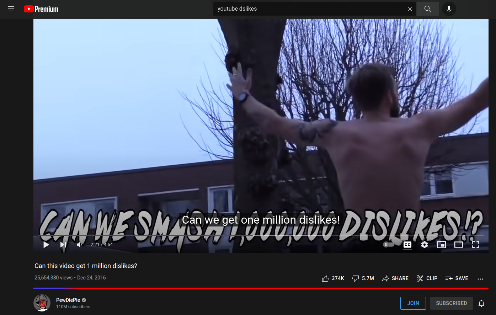

# lightsaber

A Chrome extension to restore the beloved YouTube likes/dislikes bar. This uses a simple AWS Lambda function to grab video metadata and updates the DOM

## Examples

## How to install manually
This extenstion is currently under review. Until it gets published, you can download the zip file and install it yourself!
Go to the release page and download the `lightsaber.zip` file and extract it to a directory somewhere, ideally named `lightsaber`.
Navigate to `chrome://extensions` on your Chrome browser and click on Load Unpacked. Select the extracted folder and it should automatically get enabled

Open up a new tab and navigate to YouTube. Open up any video and you should see a like/dislike bar! If you don't see one try refreshing the page. If you still encounter issues, please open up an issue in this repo!

